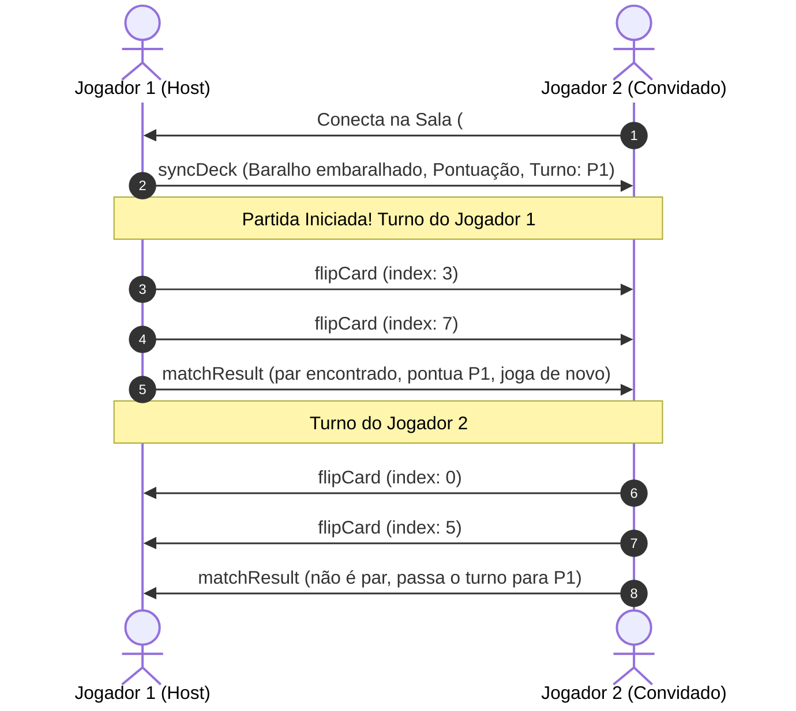
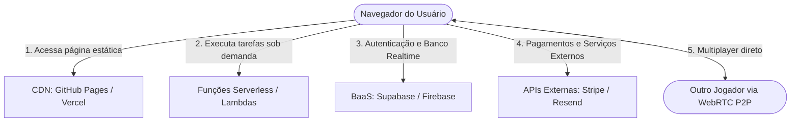

# Guia Completo: Multiplayer em Arquiteturas Jamstack

Este documento analisa a viabilidade, desafios e soluções práticas para criar jogos e aplicações multiplayer em tempo real utilizando a arquitetura **Jamstack** (JavaScript, APIs e Markup).

---

## 1. O que é Jamstack e como o Multiplayer se encaixa?

**Jamstack** é uma arquitetura moderna para desenvolvimento web baseada em:
- **J (JavaScript)**: Lógica dinâmica e interativa executada inteiramente no cliente (navegador).
- **A (APIs)**: Todas as operações de dados ou serviços externos são acessadas via HTTP/WebSockets ou serviços serverless.
- **M (Markup)**: Páginas e ativos estáticos pré-renderizados, servidos diretamente de uma CDN (como GitHub Pages, Vercel, Netlify ou Cloudflare Pages).

### 💡 Jamstack é apenas "Front-End"? (Mito Comum)

**Não!** É um erro comum achar que Jamstack significa "apenas HTML/CSS/JavaScript estático sem backend".

A principal característica do Jamstack é o **desacoplamento total entre o Front-End e o Back-End**:
- O **Front-End** é estático, pré-renderizado e entregue globalmente por CDNs (alta velocidade, baixo custo, sem servidor web processando páginas em tempo de execução).
- O **Back-End** continua existindo, mas não como um servidor monolítico tradicional (como PHP, Django ou Express rodando 24/7 na mesma máquina do site). Ele é consumido sob demanda através de **APIs REST/GraphQL**, **Serverless Functions** (ex: AWS Lambda, Vercel/Netlify Functions) ou serviços gerenciados **BaaS** (ex: Firebase, Supabase, Stripe, Auth0).

### O "Paradoxo" do Multiplayer no Jamstack
Tradicionalmente, jogos multiplayer exigem um **servidor central ativo com conexão persistente (WebSockets / TCP / UDP)** para sincronizar o estado da partida entre os jogadores.

Como em uma hospedagem Jamstack clássica você **não possui um servidor Node.js/Python dedicado rodando 24/7**, o multiplayer precisa ser resolvido de uma das seguintes formas:
1. **P2P Serverless (WebRTC)**: Os próprios navegadores dos jogadores comunicam-se diretamente entre si, sem servidor intermediário após o aperto de mão inicial.
2. **Backend-as-a-Service (BaaS)**: Uso de serviços em nuvem gerenciados que oferecem WebSockets em tempo real (ex: Firebase, Supabase Realtime, Ably).
3. **Edge Functions / Durable Objects**: Servidores efêmeros na borda que suportam WebSockets (ex: Cloudflare Workers).

---

## 2. Diagnóstico: Por que a implementação anterior com WebRTC manual falhou?

No código original (`index.html`), tentou-se implementar WebRTC P2P com troca manual de dados de sessão (*SDP Offer/Answer*). Essa abordagem costuma falhar pelos seguintes motivos:

### A. Problema de Sinalização Manual e Coleta de Candidatos ICE
Para estabelecer uma conexão WebRTC, dois clientes precisam trocar suas informações de rede (*SDP* e *ICE Candidates*).
1. **ICE Gathering Hangs**: A função `waitForIceGatheringComplete` aguarda a coleta total dos candidatos de rede. Em muitos navegadores e conexões com IPv6, mDNS ou proxies, a coleta demora de 10 a 30 segundos ou dispara de forma assíncrona fragmentada (*trickle ICE*).
2. **Sessão Expirada / Erro Humano**: O processo de copiar e colar blocos gigantes de JSON entre abas precisa de precisão cirúrgica na ordem de criação do *Offer* e do *Answer*. Se demorar alguns segundos a mais, as credenciais ICE temporárias expiram e a conexão fecha em `disconnected` ou `failed`.

### B. Bloqueio por NAT / Firewall e Ausência de Servidor TURN
O código configurava apenas o servidor STUN público do Google:
```javascript
iceServers: [{ urls: 'stun:stun.l.google.com:19302' }]
```
* **O que o STUN faz?** O STUN apenas descobre o IP público do usuário. Ele funciona bem se ambos os usuários estiverem em redes abertas ou no mesmo roteador.
* **O que faltava? (TURN Server)**: Em cerca de 15% a 25% das conexões da internet (especialmente redes 4G/5G móveis, Wi-Fi corporativo, escolas ou roteadores com NAT Simétrico), uma conexão P2P direta é **impossível**. Nesses casos, o WebRTC exige um servidor de relay chamado **TURN**. Sem TURN, a conexão falha silenciosamente.

### C. Ausência de Máquina de Estados e Controle de Turnos
* O jogo apenas replicava o evento `flip` com o índice da carta.
* Não havia definição de quem era o **Jogador 1** ou **Jogador 2**.
* Não havia bloqueio de ações fora do turno, permitindo que ambos os jogadores clicassem ao mesmo tempo, quebrando a sincronização do tabuleiro e a lógica de vitória.

---

## 3. Comparativo de Abordagens Multiplayer no Jamstack

| Abordagem | Custo / Infra | Complexidade | Latência | Casos de Uso Recomendados |
| :--- | :--- | :--- | :--- | :--- |
| **Opção 1: WebRTC Serverless (Trystero / PeerJS)** | **100% Gratuito (Zero backend)** | Média | Ultra-baixa (direta P2P) | Jogos casuais, 1v1, tabuleiros, apps P2P sem custo de servidor |
| **Opção 2: BaaS Realtime (Firebase / Supabase)** | Gratuito na camada free | Baixa | Baixa (~50-100ms) | Jogos com ranking, contas de usuário, persistência de dados |
| **Opção 3: Edge Computing (Cloudflare Workers)** | Custo por requisição | Alta | Muito baixa | Jogos competitivos autoritativos (anti-trapaça em larga escala) |

---

## 4. Como funciona a Opção 1 (WebRTC Serverless com Trystero)

A **Opção 1** adota a biblioteca **Trystero** (feita sob medida para Jamstack e WebRTC serverless).

### Como o pareamento funciona sem servidor?
1. **Descoberta da Sala (Signaling público)**: Quando o jogador entra na sala (ex: `#sala-x9k2`), o Trystero utiliza a rede descentralizada pública de **BitTorrent Trackers** ou **MQTT** exclusivamente para fazer a troca inicial de chaves e candidatos ICE (apenas alguns kilobytes de texto).
2. **Aperto de Mão Automático**: Ninguém precisa copiar e colar SDPs; o navegador negocia a conexão automaticamente em menos de 1 segundo.
3. **Canal de Dados P2P (`RTCDataChannel`)**: Assim que a conexão é feita, toda a comunicação do jogo ocorre de navegador para navegador de forma criptografada e direta.

### Protocolo de Mensagens do Jogo da Memória
O jogo utiliza ações tipadas transmitidas pelo canal P2P:



---

## 5. Resumo das Boas Práticas para Jogos em Jamstack

1. **Estado Autoritativo Compartilhado**: Defina um dos nós (geralmente quem criou a sala) como o "Host", responsável por gerar as cartas aleatórias e resolver empates.
2. **Feedback Visual Imediato**: Exiba claramente na interface de quem é a vez, o estado da conexão ("Conectando...", "Conectado", "Aguardando Jogador 2") e bloqueie cliques quando não for a vez do usuário.
3. **Links Compartilháveis com Hash / Query**: Permita que o jogador simplesmente clique em "Copiar Link" (ex: `https://meusite.com/#sala-abc`) para convidar um amigo pelo WhatsApp ou Discord instantaneamente.

---

## 6. Como Funciona o Back-End no Jamstack? (Visão Detalhada)

### A. Back-End Tradicional (Monolítico) vs Back-End Jamstack

No modelo monolítico clássico, você precisava alugar uma máquina dedicada (VPS/Cloud) rodando 24 horas por dia:
* **Monolítico**: O servidor web (Apache, Nginx, Node.js, PHP) processa o HTML e consulta o banco a cada requisição. O Front e o Back estão presos na mesma máquina.
* **Jamstack**: O Front-End é entregue pré-renderizado via **CDNs globais** (como GitHub Pages, Vercel ou Cloudflare), enquanto o Back-End é **desacoplado, sob demanda e modular**.

| Critério | Modelo Tradicional (Servidor Dedicado) | Modelo Jamstack (Serverless / Desacoplado) |
| :--- | :--- | :--- |
| **Infraestrutura** | Servidor ligado 24/7 (VPS / Instância Cloud). | Site servido estaticamente em CDN global. |
| **Custo Fixo** | Paga-se pelo servidor ligado, mesmo sem acessos. | **Custo R$ 0,00** ou apenas por requisições ativas. |
| **Manutenção** | Atualizações de SO, segurança, certificados SSL manuais. | **Zero manutenção de servidor** (gerenciado pelo provedor). |
| **Escalabilidade** | Exige configuração de Load Balancer e auto-scaling. | Escala instantânea para milhões de acessos sem configuração. |
| **Segurança** | Portas de servidor e banco expostas a ataques. | Superfície de ataque mínima (sem servidor web para invadir). |

---

### B. Os 4 Pilares do Back-End no Jamstack



1. **Funções Serverless (Lambdas / Edge Functions)**:
   - Trechos de código (Node.js, Python, Go) que ficam adormecidos na nuvem.
   - Quando o front-end chama um endpoint (ex: `fetch('/api/contato')`), a função executa em milissegundos, processa os dados e desliga imediatamente. Paga-se apenas pelo tempo de execução.
2. **BaaS (Backend-as-a-Service)**:
   - Plataformas prontas que eliminam a necessidade de construir servidores de infraestrutura básica:
     - **Banco de Dados & Realtime**: Supabase (PostgreSQL), Firebase Firestore.
     - **Autenticação**: Clerk, Auth0, Supabase Auth.
3. **Headless CMS**:
   - Painéis para gestão de conteúdo (ex: Strapi, Sanity, Contentful). Quando um post é publicado, um *Webhook* dispara a re-geração estática da página na CDN.
4. **Computação P2P (Peer-to-Peer)**:
   - Como implementado neste projeto: os próprios navegadores dos jogadores processam as regras e trocam mensagens diretamente via WebRTC, eliminando qualquer custo de servidor de jogo.

---

### C. Quando Utilizar a Arquitetura Jamstack?

* **✅ Recomendado para**:
  - Landing pages, sites institucionais e blogs (alta velocidade e SEO).
  - Dashboards, SaaS e SPAs consumindo APIs ou bancos gerenciados.
  - E-commerces com front-end desacoplado e checkout via API (Stripe/Shopify).
  - Jogos casuais e ferramentas web P2P sem servidor.
* **⚠️ Evitar quando**:
  - Aplicações com processamento contínuo e pesado de longa duração (ex: renderização contínua de vídeos 4K por horas).
  - Sistemas legados altamente acoplados onde não há interesse ou orçamento para desacoplar front e back.

